Our project is a comprehensive analysis of the telecom industry, focusing on addressing key challenges like customer churn, low profit margins , and poor customer feedback.

Key Highlights:
- Data Preparation: We sourced the data from the Kaggle platform and built a structured database.
- Data Warehouse Creation: After studying the data, we designed and implemented an optimal data warehouse for efficient storage and retrieval.
- ETL Process: We executed an ETL process to clean and load the data into the warehouse , ensuring accuracy and consistency.
- Cube Design: Cubes were built to streamline reporting and enable deeper analysis .
- Report Development: We created four detailed reports that highlight the critical factors contributing to customer churn and other pressing issues.
- Multi-Tool Analysis: Our team used Power BI, Tableau, and Excel to deliver comprehensive insights, ensuring a diverse and accurate representation of the data.

1- Overview: Company performance and economic standing 💼.
2- Customer: Insights on customer churn and satisfaction 📊.
3- Internet Services: Analysis of internet offerings 🌐.
4- Phone Services: Evaluation of mobile services 📱.
5- Churn Analysis: Deep dive into customer churn causes 🔍.
6- Geographic Analysis: Visualizing company presence across regions 🌍.

This analysis also includes a forward-looking projection (Forecast) for next year, highlighting potential risks if no improvements are made.

Power BI Analysis:

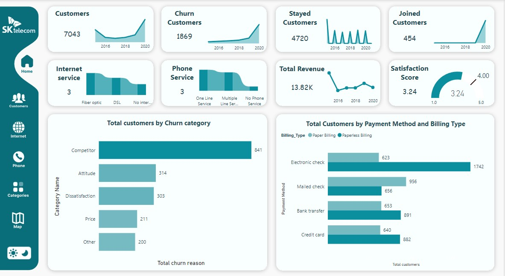
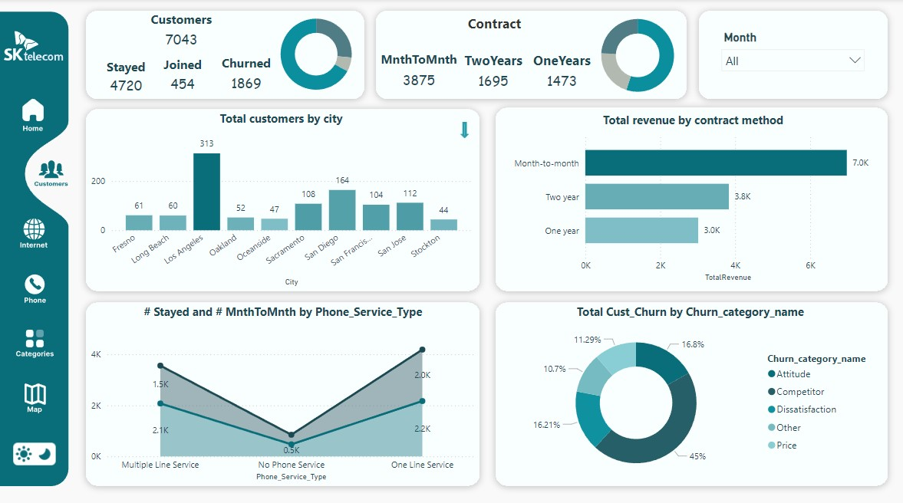
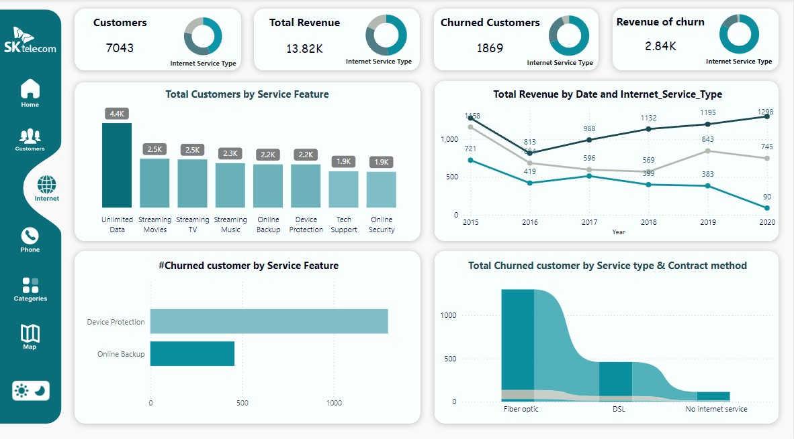
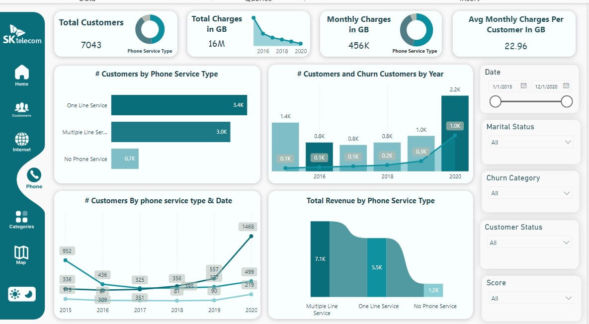
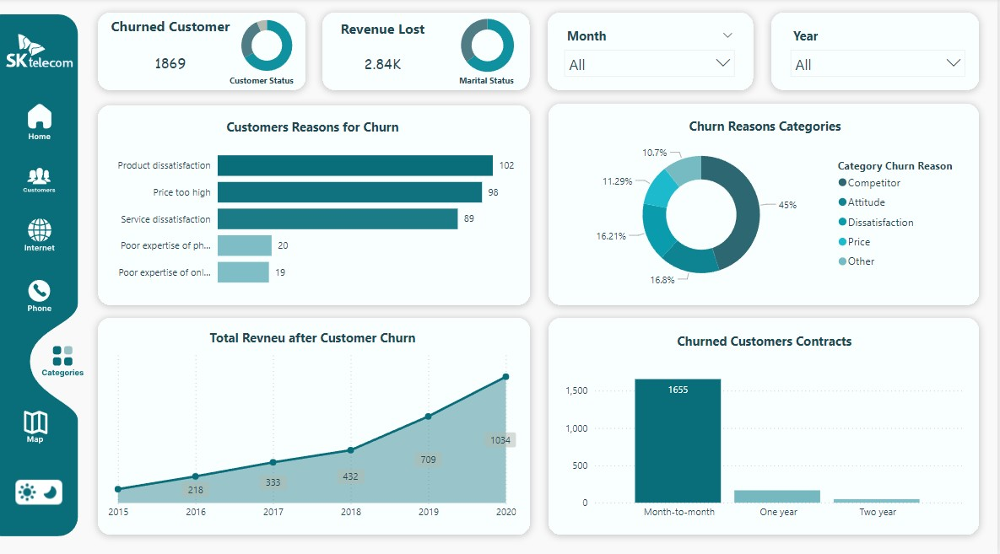
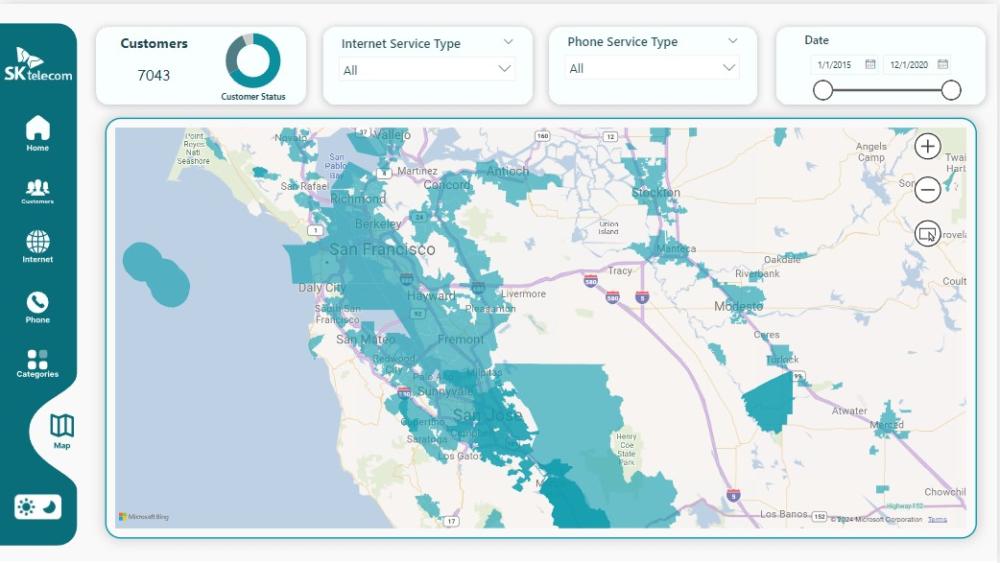

Tableau Analysis:
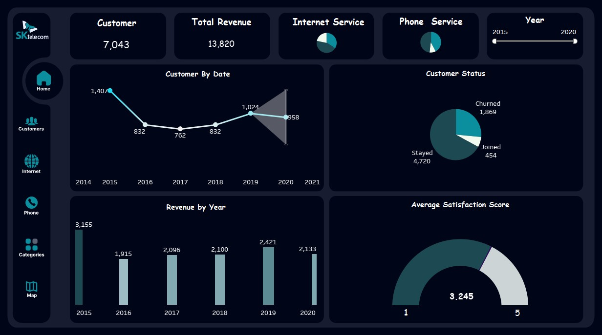
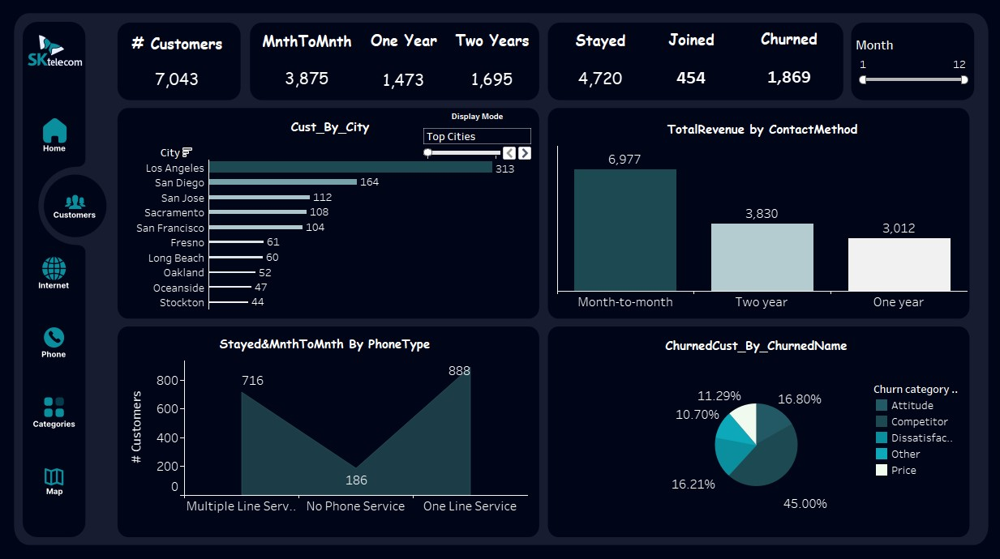
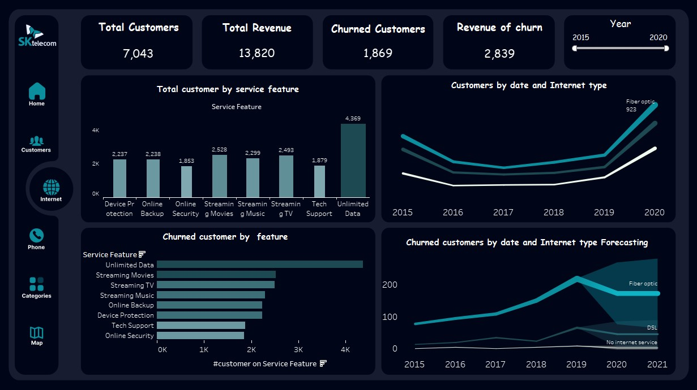
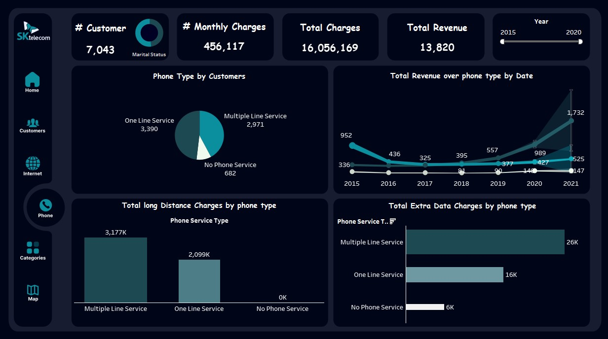
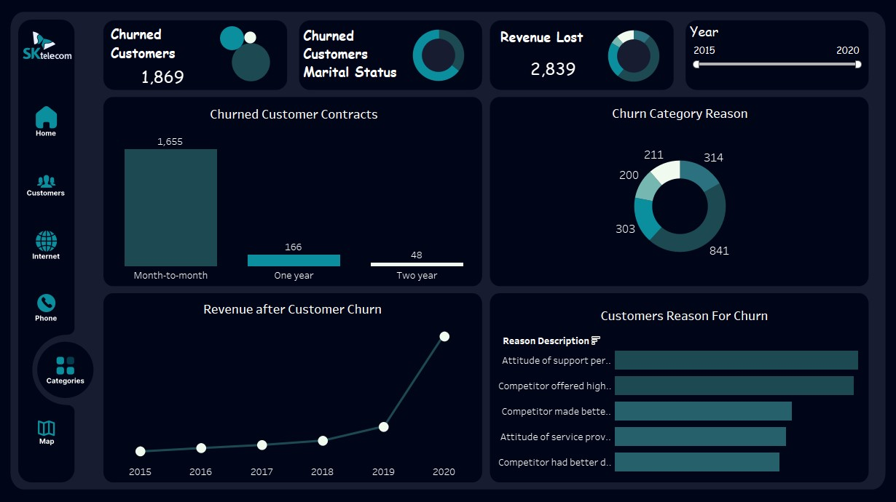
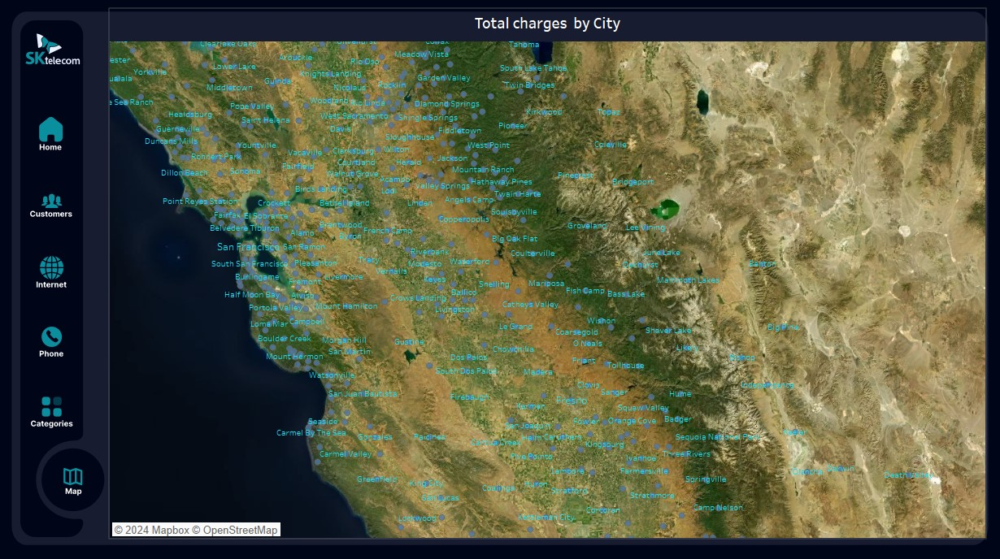
